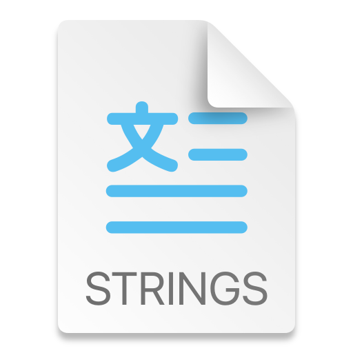

  

## 
<b><a href="README.md">English</a> | <a href="README_CN.md">简体中文</a></b>

# 本地化大师 (Localization Master)

「本地化大师」是一款专为iOS/macOS开发者和本地化团队打造的Mac端应用程序。它旨在简化Localizable.xcstrings文件的本地化工作流程，提高工作效率，并确保高质量的本地化结果。

[立即在 Mac App Store 下载](https://apps.apple.com/us/app/localization-master/id6504154553?mt=12)

## 主要特性

- **智能解析**: 自动解析Localizable.xcstrings文件，精确识别需要翻译的文本。
- **多种翻译服务**: 支持Microsoft Edge、Google等多种翻译服务，实现高效批量翻译。
- **一键更新**: 翻译完成后，一键将结果同步更新到Xcode的本地化文件中。
- **用户友好界面**: 直观易用的界面设计，让您专注于本地化工作，提升效率。
- **灵活管理**: 支持导入外部翻译内容，实现多样化的翻译工作流程。

## 使用指南

1. **安装与启动**
   - [从 Mac App Store 下载](https://apps.apple.com/us/app/localization-master/id6504154553?mt=12)并安装「本地化大师」到您的Mac。
   - 启动应用程序。

2. **导入.xcstrings文件**
   - 将**Localizable.xcstrings**文件拖拽到应用程序窗口中。

3. **选择翻译服务或导入外部翻译**
   - 在「翻译服务」选项卡中，选择您偏好的翻译服务。
   - 或者，导入您通过其他方式获得的翻译内容。

4. **管理翻译内容**
   - 审核、编辑或补充翻译内容。

5. **同步到Xcode**
   - 翻译完成后，点击「同步到源文件」按钮，将翻译结果更新到原始的**Localizable.xcstrings**文件。

## 高级功能: 外部翻译内容管理

「本地化大师」不仅提供内置翻译服务，还支持管理和同步您通过其他方式获得的翻译内容：

1. 使用您偏好的翻译工具或AI服务进行翻译（如OpenAI、DeepL等）。
2. 将翻译结果整理为JSON格式，并复制到剪贴板。
3. 在「本地化大师」中，选择 **文件 -> 从剪贴板粘贴并导入翻译内容**（或使用快捷键 **Command + Shift + V**）。
4. 「本地化大师」将自动导入并管理这些翻译内容，让您可以轻松地将其同步到Xcode项目中。

这一功能使「本地化大师」成为您管理和同步**Localizable.xcstrings**翻译内容的中心枢纽，无论翻译来源如何。

## 功能演示视频

为了帮助您更好地了解「本地化大师」的功能和使用方法，我们提供了以下演示视频：

1. **Google翻译演示**
   - 展示如何使用Google翻译服务进行本地化。
   - Bilibili: [待添加]
   - YouTube: [待添加]

2. **Microsoft Edge翻译演示**
   - 演示使用Microsoft Edge翻译服务的过程。
   - Bilibili: [待添加]
   - YouTube: [待添加]

3. **AI辅助翻译演示**
   - 展示如何使用OpenAI进行翻译，并将结果导入到应用中进行管理和同步。
   - 注意：OpenAI仅作为示例。您可以使用任何喜欢的翻译工具或AI服务，「本地化大师」都能帮助您管理和同步这些翻译内容。
   - Bilibili: [待添加]
   - YouTube: [待添加]

这些视频将帮助您快速上手「本地化大师」，充分利用其强大的管理和同步功能。

## 注意事项

- 本应用专门用于管理和同步**Localizable.xcstrings**文件的翻译内容。
- 同步到源文件时会覆盖原文件内容，请提前备份重要数据。
- 详细使用说明和最佳实践请参考应用内的帮助文档。

## 支持与反馈

我们致力于为您提供最佳的用户体验。如果您在使用过程中遇到任何问题或有改进建议，欢迎通过以下方式联系我们：

- 直接在应用中提交反馈
- 发送邮件至：[support@localizationmaster.com](mailto:support@localizationmaster.com)

## 隐私政策

我们重视您的隐私。请查看我们的[隐私政策](https://www.localizationmaster.com/privacy)以了解我们如何保护您的数据。

「本地化大师」 - 让iOS/macOS应用本地化管理变得简单高效！

[立即下载体验](https://apps.apple.com/us/app/localization-master/id6504154553?mt=12)
